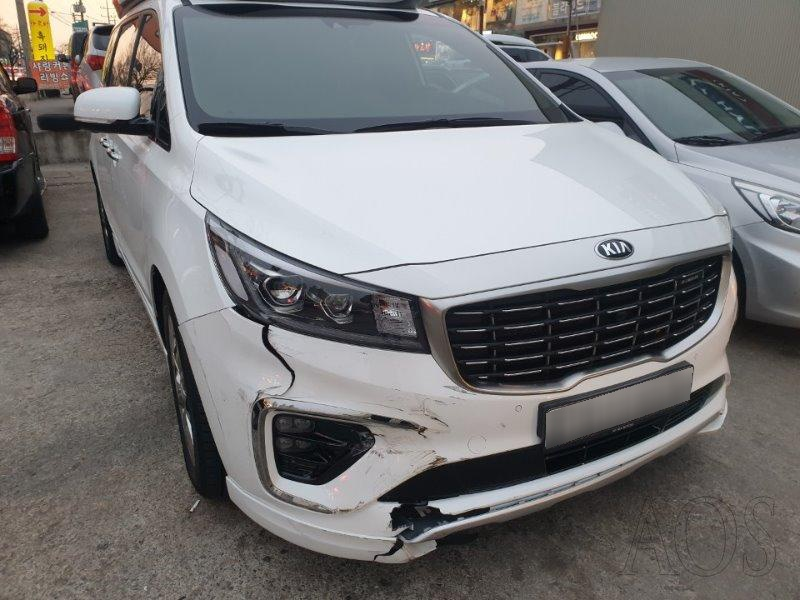
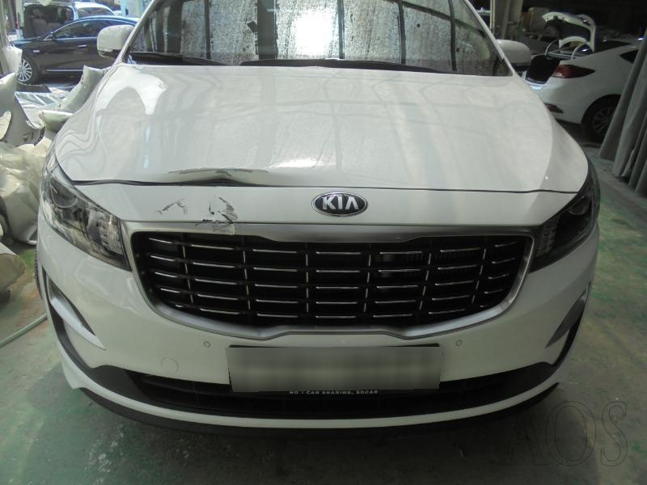
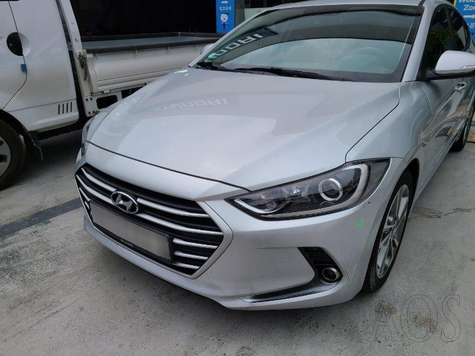
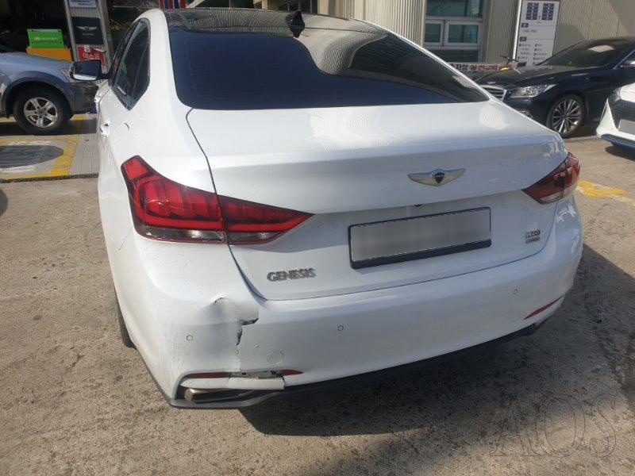
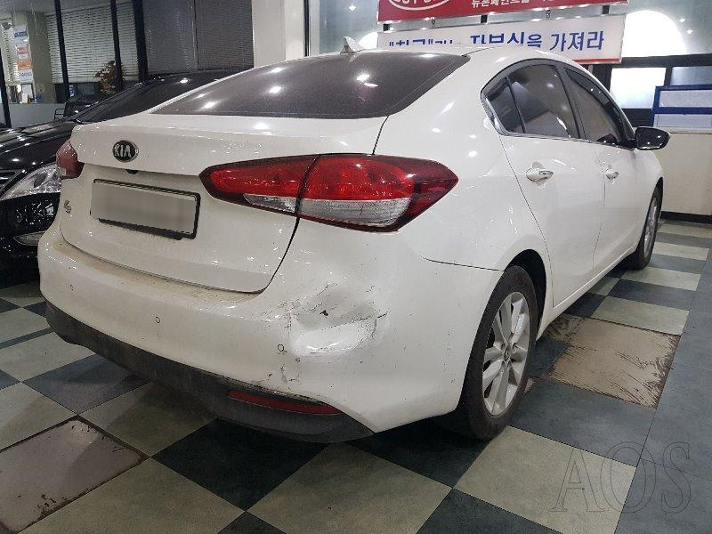
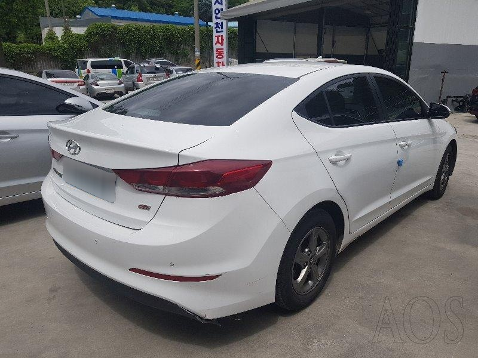
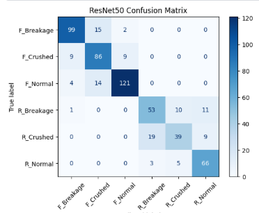
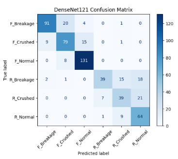

# Car Damage Classification


Deep learning system that classifies car exterior damage from images into six categories (front/rear breakage, crushed, or normal) using transfer learning with pretrained CNN architectures.

## 📸 Sample Images from the Six Vehicle Damage Classes

| Front Breakage | Front Crushed | Front Normal | Rear Breakage | Rear Crushed | Rear Normal |
|:--------------:|:-------------:|:------------:|:-------------:|:------------:|:-----------:|
|  |  |  |  |  |  |

## Table of Contents
- [Overview](#overview)
- [Dataset](#dataset)
- [Model Architecture](#model-architecture)
- [Results](#results)
- [Setup & Installation](#setup--installation)
- [Usage](#usage)
- [Live Demo](#live-demo)
- [Project Structure](#project-structure)
- [Limitations & Future Work](#limitations--future-work)

## Overview

This project builds an automated car damage classification pipeline that identifies both the **location** (front/rear) and **severity** (breakage, crushed, or normal) of vehicle exterior damage from a single image. Two transfer-learning approaches — ResNet50 and DenseNet121 — are trained and benchmarked against each other under a unified training and evaluation setup, with the goal of supporting use cases such as automated insurance claim triage and vehicle inspection.

## Dataset

- **Source:** Custom dataset hosted on Kaggle ([`car-dataset`](https://www.kaggle.com/datasets/adekoyaoluwatobi/car-dataset)) 
- **Size:** 2,300 labeled images
- **Classes (6):**
  | Class | Description |
  |---|---|
  | `F_Breakage` | Front — breakage damage |
  | `F_Crushed` | Front — crushed damage |
  | `F_Normal` | Front — no damage |
  | `R_Breakage` | Rear — breakage damage |
  | `R_Crushed` | Rear — crushed damage |
  | `R_Normal` | Rear — no damage |
- **Split:** 75% train / 25% validation (1,725 / 575 images), using a random split with a fixed folder structure loaded via `torchvision.datasets.ImageFolder`
- **Preprocessing & Augmentation:**
  - Resize to 224×224
  - Random horizontal flip
  - Random rotation (±10°)
  - Color jitter (brightness/contrast, ±0.2)
  - Normalization using ImageNet mean/std (`[0.485, 0.456, 0.406]` / `[0.229, 0.224, 0.225]`)

## 📸 Representative Images from the Six Vehicle Damage Classes

| Front Breakage | Front Crushed | Front Normal |
|:--------------:|:-------------:|:------------:|
|  |  |  |

| Rear Breakage | Rear Crushed | Rear Normal |
|:-------------:|:------------:|:-----------:|
|  |  |  |

## Model Architecture

Two convolutional neural networks, both pretrained on ImageNet, were fine-tuned using a **partial-freezing transfer learning** strategy — the early layers are frozen to retain general visual features, while the final block and classification head are fine-tuned on the car damage dataset.

| Component | ResNet50 | DenseNet121 |
|---|---|---|
| Backbone | `torchvision.models.resnet50` (ImageNet weights) | `torchvision.models.densenet121` (ImageNet weights) |
| Frozen layers | All except `layer4` | All except `denseblock4` |
| Classifier head | `Dropout(0.5)` → `Linear(→ 6 classes)` | `Dropout(0.5)` → `Linear(→ 6 classes)` |
| Loss function | Cross-Entropy Loss | Cross-Entropy Loss |
| Optimizer | Adam, lr = 0.001 (trainable params only) | Adam, lr = 0.001 (trainable params only) |
| Epochs | 10 | 10 |
| Batch size | 32 | 32 |
| Hardware | Kaggle T4 GPU | Kaggle T4 GPU |

Both models were trained under identical conditions to allow a fair, apples-to-apples comparison.


## Results

| Model | Accuracy | Precision | Recall | F1-Score | Training Time |
|---|---|---|---|---|---|
| **ResNet50** | **80.70%** | **80.87%** | **80.70%** | **80.58%** | 727.06s (~12.1 min) |
| DenseNet121 | 77.04% | 78.15% | 77.04% | 76.77% | 668.96s (~11.1 min) |

*(Precision, Recall, and F1-Score are weighted averages across the 6 classes.)*

**ResNet50 outperformed DenseNet121 on every classification metric** in this experiment, though DenseNet121 trained slightly faster. Full per-class performance is available in the confusion matrices generated in the notebook.

## 📊 Confusion Matrices

| ResNet50 | DenseNet121 |
|:---------:|:-----------:|
|  |  |


## Setup & Installation

### Prerequisites
- Python 3.9+
- CUDA-capable GPU (recommended; the notebook was trained on a Kaggle T4 GPU)

### 1. Clone the repository
```bash
git clone https://github.com/adekoya759/car_damage_prediction 
cd car_damage_prediction
```

### 2. Create a virtual environment and install dependencies
```bash
python -m venv venv
source venv/bin/activate      # On Windows: venv\Scripts\activate

pip install torch torchvision scikit-learn pandas matplotlib
```

### 3. Download the dataset
Download the dataset from Kaggle and place it in a `dataset/` folder structured as:
```
dataset/
├── F_Breakage/
├── F_Crushed/
├── F_Normal/
├── R_Breakage/
├── R_Crushed/
└── R_Normal/
```
Update the `dataset_path` variable in the notebook to point to your local copy.

## Usage

1. Open `car_damage_prediction.ipynb` in Jupyter Notebook, JupyterLab, Kaggle, or Google Colab. - https://www.kaggle.com/code/adekoyaoluwatobi/car-damage-prediction 
2. Run all cells sequentially to:
   - Load and preprocess the dataset
   - Train the ResNet50 and DenseNet121 classifiers
   - Evaluate both models (accuracy, precision, recall, F1-score, confusion matrices)
3. Trained weights are saved as:
   - `resnet50_car_damage.pth`
   - `densenet121_car_damage.pth`


## Live Demo

https://car-damage--prediction.streamlit.app/ 

## Project Structure

```
car-damage-prediction/
├── car_damage_prediction.ipynb   # Main notebook: data pipeline, training, evaluation
├── resnet50_car_damage.pth       # Saved ResNet50 weights (generated after training)
├── densenet121_car_damage.pth    # Saved DenseNet121 weights (generated after training)
├── dataset/                     
└── README.md
```


## 👨‍💻 Author

**Oluwatobi Adekoya**

- 🌐 Portfolio: https://dantechonline.com.ng

